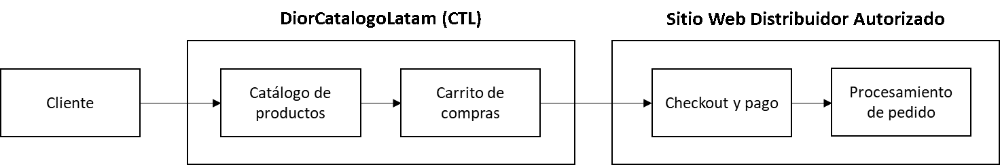

# DiorCatalogoLatam - Integración para distribuidores.
Guia de integración para distribuidores Dior.

## Índice
* [Acerca de la integración](#acerca-de-la-integración)
* [Requisitos](#requisitos)
    * [Proceso de solicitud](#proceso-de-solicitud)
* [Flujo de información](#flujo-de-información)
* [Estructura de Datos (Payload)](#estructura-de-datos-payload)
* [Validación de Firma Criptográfica](#validación-de-firma-criptográfica)
* [Otras recomendaciones de seguridad](#otras-recomendaciones-de-seguridad)
    * [Protección de clave compartida (shared secret)](#protección-de-clave-compartida-shared-secret)
    * [Validación de fecha de creación](#validación-de-fecha-de-creación)
* [Apéndice](#apéndice)
    * [Apéndice 1 - Flujo desde punto de vista de cliente](#apéndice-1---flujo-desde-punto-de-vista-de-cliente)

## Acerca de la integración
El sistema DiorCatalogoLatam (DCL) permite a distribuidores autorizados Dior la recepción de solicitudes de compra 
generadas en diorcatalogolatam.com.
Esta integración hace posible que un cliente escoja una variedad de productos, los agregue en su bolsa o carrito de 
compras virtual dentro de DCL y realice el checkout o pago de su orden a través del sitio web de un distribuidor local 
autorizado.

## Requisitos
Antes de comenzar es necesario considerar los siguientes requisitos:
* Ser una organización aprobada por Dior para la integración con DCL
* Tener un sitio web de compra electrónica (ecommerce)
* Tener un servicio web capaz de recibir data de un servicio externo y transformar dicha data para generar una bolsa o 
carrito de compra virtual.

### Proceso de solicitud
Antes de comenzar la integración, es necesario informar a su representante Dior lo siguiente:
* URL donde se recibirá la data enviada por DCL.
* Fecha estimada de desarrollo, pruebas y lanzamiento.

Una vez su solicitud sea aprobada, su representante Dior validará esta información y le enviará su clave compartida 
(shared secret).
 
## Flujo de información
Antes de considerar cualquier otra información, es necesario considerar el flujo de procesos e información:
1.	Cliente entra a diorcatalogolatam.com (DCL)
2.	Cliente selecciona y agrega varios productos a su carrito de compras
3.	Cliente visita su carrito de compras y elige continuar al checkout.
4.	DCL genera una solicitud POST en JSON con la información del carrito al sistema de distribuidor incluyendo una 
firma virtual de la solicitud.
5.	Distribuidor recibe la solicitud y valida la firma criptográfica.
6.	Distribuidor crea un carrito de compras incluyendo todos los productos enviados en la solicitud POST.
7.	Distribuidor redirige el carrito automáticamente a su checkout.
8.	Cliente paga por su orden.
9.	Distribuidor procesa el pedido.

 

**Nota:** Para ver el flujo de información desde el punto de vista del cliente, vea el 
[apéndice #1](#apndice-1---flujo-desde-punto-de-vista-de-cliente).

## Estructura de Datos (Payload)

Una vez el cliente envía la solicitud, DCL envía un array codificado en JSON incluyendo los siguientes campos:

1.  **cart:** Un array incluyendo un identificador único (UUID) para el carrito de compras. Este identificador puede ser usado
opcionalmente para mantener registros. Ya que solo un UUID es generado por cada sesión de un usuario, es posible recibir
varias solicitudes con el mismo UUID.

2.  **created_time:** Provee la fecha de la solicitud en formato [ISO8601](https://en.wikipedia.org/wiki/ISO_8601).

3.  **products:** Incluye un array de productos con las siguientes características:
      1. **ean:** El código EAN del producto. Este valor debe usarse para atar el producto solicitado con el 
      producto existente localmente. 
      2. **name:** El nombre del producto. Provisto para propósitos de referencia solamente.
      3. **quantity:** La cantidad del producto solicitada.
      
4.  **signature:** La firma criptográfica que válida la integridad de la data provista. 

Por ejemplo, así se vería un payload generado por DCL:
```
 [
   "cart" => [
     "uuid" => "16f70008-8ac7-4b4e-b930-78411a2320fe",
   ],
   "created_time" => "2020-05-07T20:13:59+00:00",
   "products" => [
     [
       "ean" => 3348900012189,
       "name" => "FAHRENHEIT EDT SPRAY 50 ML",
       "quantity" => 2,
     ],
     [
       "ean" => 3348901419086,
       "name" => "JOY EAU DE PARFUM NATURAL 50ML",
       "quantity" => 3,
     ],
   ],
   "signature" => "f5619fae4df52ae0b6c505d703233ac2592d916345b0560d2f59678c08a56613",
 ]
```
## Validación de Firma Criptográfica

Cada payload enviado por DCL viene acompañado de una firma criptográfica que garantiza la integridad de la información
recibida. Esta firma puede ser usada asegurarse que ninguna parte del payload fue modificada entre DCL y el sistema
del distribuidor. Aunque esta validación es opcional, su uso es recomendado.

La firma es generada usando [HMAC](https://en.wikipedia.org/wiki/HMAC) con `SHA-256` sobre el array original organizado, 
excluyendo la firma, codificado en JSON. Para garantizar que el orden de las propiedades no afecte la firma generada, 
el array es ordenado multi-dimensionalmente antes de ser codificado. Por último, se usa una clave compartida 
(shared secret) que tanto DCL como el distribuidor deben usar para crear y validar la firma.

Aunque DCL intenta enviar la data organizada, esto no es garantizado y es recomendado asegurarse que el orden de la data
recibida es correcta. Para garantizar que el orden no afectará la firma creada, es necesario organizarlo por clave y valor. 

Por ejemplo, en PHP usaríamos la siguiente función para organizar un array:

```
class Arr {
    /**
     * Recursively sort an array by keys and values.
     *
     * @param  array  $array
     * @return array
     */
    public static function sortRecursive($array): array
    {
        foreach ($array as &$value) {
            if (is_array($value)) {
                $value = static::sortRecursive($value);
            }
        }

        if (static::isAssoc($array)) {
            ksort($array);
        } else {
            sort($array);
        }

        return $array;
    }
}
```

Después de ejecutar esta función, nuestro array se vería de la siguiente forma:

```
 [
   "cart" => [
     "uuid" => "16f70008-8ac7-4b4e-b930-78411a2320fe",
   ],
   "created_time" => "2020-05-07T20:13:59+00:00",
   "products" => [
     [
       "ean" => 3348900012189,
       "name" => "FAHRENHEIT EDT SPRAY 50 ML",
       "quantity" => 2,
     ],
     [
       "ean" => 3348901419086,
       "name" => "JOY EAU DE PARFUM NATURAL 50ML",
       "quantity" => 3,
     ],
   ],
 ]
```

Luego de esto, el array se codificaría en JSON y se cifraría usando `hmac`.

Por ejemplo, considere el proceso completo en PHP:

```
    /**
     * Get a cryptographic signature for an array
     * 
     * @param  array  $array
     * @param  string  $secret
     * @return string
     */
    public static function getSignature($array, $secret): string
    {
        $array = Arr::sortRecursive($array);

        return hash_hmac(
            'sha256',
            json_encode($array),
            $secret
        );
    }
```
Usando esta función con un `$secret =  'wEqGyLOotzHL40GCEFDLtSTkzOsDKPZ3'`, el valor resultante sería 
`f5619fae4df52ae0b6c505d703233ac2592d916345b0560d2f59678c08a56613`. Ya que este valor es igual al valor recibido en el
payload original, podemos confirmar que el payload no fue alterado entre su creación por DCL y su recepción por el 
distribuidor.

## Otras recomendaciones de seguridad

### Protección de clave compartida (shared secret)
Ya que la clave compartida (shared secret) solo debe ser conocida por DCL y el distribuidor, es recomendado hacer cualquier
validación que incluya este valor del lado del servidor (server-side) y no del lado del explorador (client-side). 

### Validación de fecha de creación
Ya que en la mayoría de los casos el tiempo entre que DCL genera un payload y es recibido por el distribuidor es muy
corto, el payload recibido nunca debería tener más de 5 minuto de antigüedad. Por eso es recomendado invalidar 
payloads con una fecha de creación (`created_time`) que tengan más de 5 minutos de antigüedad.

## Apéndice 
### Apéndice 1 - Flujo desde punto de vista de cliente

1. Cliente entra a DCL y añade un producto a su carrito
      
     
2. Cliente visita su carrito de compras y elige continuar al checkout
     

3. Cliente es redirigido al checkout en la página del distribuidor y culmina la transacción
     
